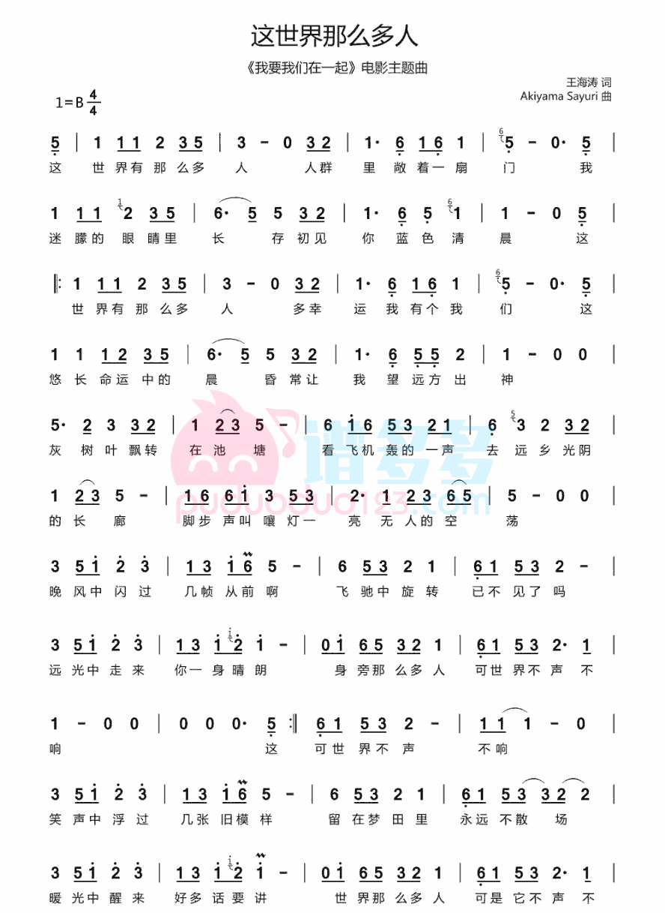

# 这世界那么多人

## 演奏

<iframe src="//player.bilibili.com/player.html?aid=766424858&bvid=BV1Rr4y1h7nR&cid=506934700&page=1" scrolling="no" border="0" frameborder="no" framespacing="0" allowfullscreen> </iframe>

## 简谱（c 调）

```
(#4 777) #1#2#4#2
#2#1 (7) (#57#57 #5#4)
(#4 777)#1#2#4 #5 #4
#2 #1 (7) (#5#4#577)

②
(#4 777) #1#2#4#2
#2#1 (7) (#57#57 #5#4)
(#4 77 7)#1#2#4 #5 #4
#2 #1 (7) (#5#4#4)#1(7)

#4#1#2#2#1(7)#1#2#4
#57#5#4#2#1(7#5)#4#2#1
#2 #1 (7) #1#2#4
(7)#5#57#2 #4#2#1(7)#1#2#5#4

#2#47【#1】【#2】 (7)#27#5#4
#5#4#2#1(7) (#57)#4#2#1
#2#47【#1】【#2】 (7)#27【#1】7
7#5#4#2#1(7) (#57)#4#2#1(77)
②x2

#2#47【#1】【#2】 (7)#27#5#4
#5#4#2#1(7) (#57)#4#2#1
#2#47【#1】【#2】 (7)#27【#1】7
7#5#4#2#1(7) (#57)#4#2#1(77)

(#4 777) #1#2#4#2
#2#1 (7) (#57#57 #5#4)
(#4 777)#1#2#4 #5 #4
#2 #1 (7) (#5#4) (#4)#1(7)
```

## 简谱（b 调）



