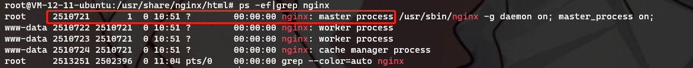
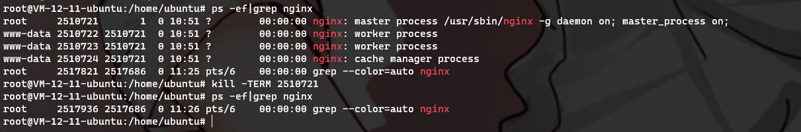

# 常用命令

## 启动

```
systemctl start nginx
```

## 停止

- 查看进程：`ps -ef|grep nginx`

  

- 停止进程：`kill -TERM 2510721`

  

## 其他常用命令汇总

```bash
# 修改配置后重新加载生效
nginx -s reload

# 校验配置文件是否正确
nginx -t -c /path/to/nginx.conf

```
