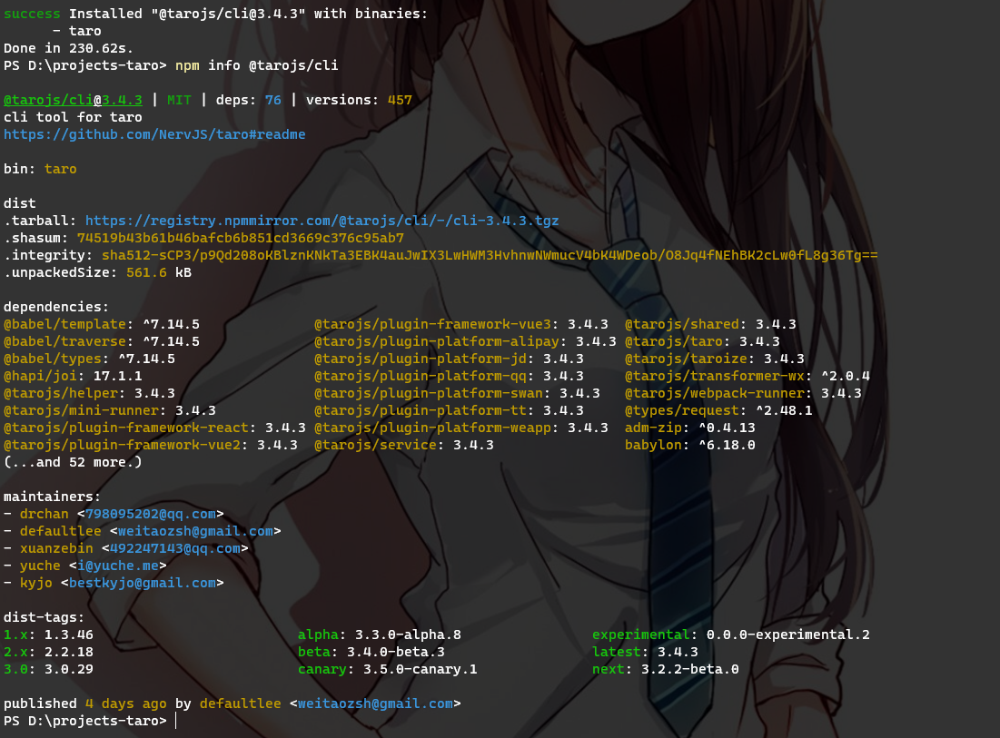
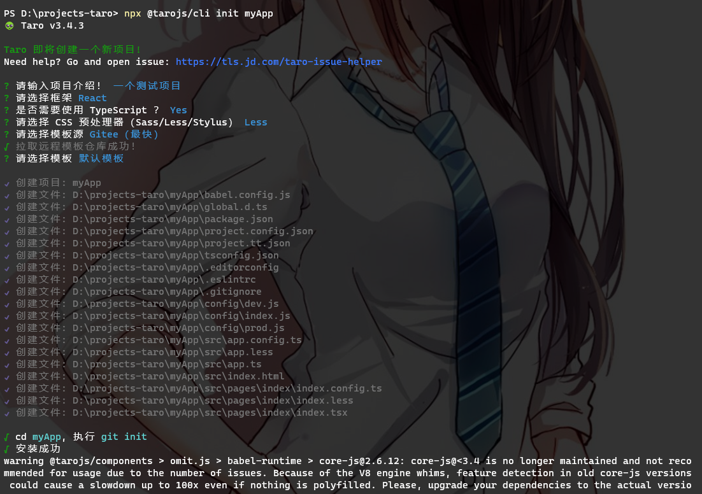

# Taro 安装和使用

## 安装

```bash
yarn global add @tarojs/cli
```

官网说安装过程可能会出现`sass`相关的安装错误，解决办法是安装`mirror-config-china`:

```bash
npm install -g mirror-config-china
```

我这里安装没出现问题，没试过

## 查看信息

```bash
npm info @tarojs/cli
```

结果如下：



## 创建项目

```bash
# 使用命令创建模板项目：
taro init myApp
# or 也可在不全局安装的情况下使用 npx 创建模板项目：
npx @tarojs/cli init myApp
```

结果如下：



## 运行项目（h5）

```bash
yarn dev:h5
yarn build:h5
```

结果如下：


