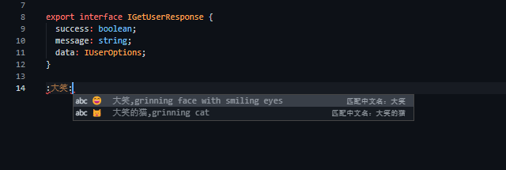
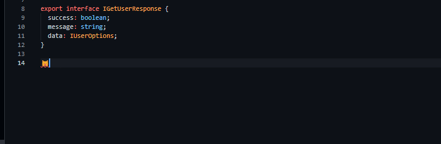
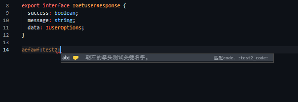

---
nav:
  title: vscode-plugin-emoji
  order: 1
toc: menu
order: 1
---

# vscode-plugin-emoji

## 介绍

一款方便的在 vscode 中插入 emoji 的工具，包含各种提示（code、关键字、分类、专题集合等），也可以查询 emoji 含义。

## 安装

在 vscode 插件市场搜索

## 使用

输入`:XX:`，就可以搜索 XX 相关的 emoji，进行语法提示：



选择需要的 emoji，会自动进行替换：



## 数据来源

保存 emoji 的相关数据到 plugin 本地中，会不定期更新相关数据

## 自定义

如果想要自己定义一些 emoji 数据，请按照以下格式(可以缺省，image 必填)，对插件进行配置：

```ts
{
  image: string,
  groupName?: string,
  subGroupName?: string,
  nameZh?: string,
  nameEn?: string,
  collections?: string[],
  detail?: {
    unicode_version?: string,
    unicode_code?: string,
    code?: string,
    keywords?: string[]
  }
}

```

示例：

```json
"emojiConfig.emojis": [
  {
    "image": "🤛",
    "nameZh": "朝左的拳头测试关键名字",
    "detail": {
      "code": ":test2_code:",
    }
  }
]
```

结果：



## 项目地址

[github](https://github.com/awesomeWDB/vscode-plugin-emoji.git)
